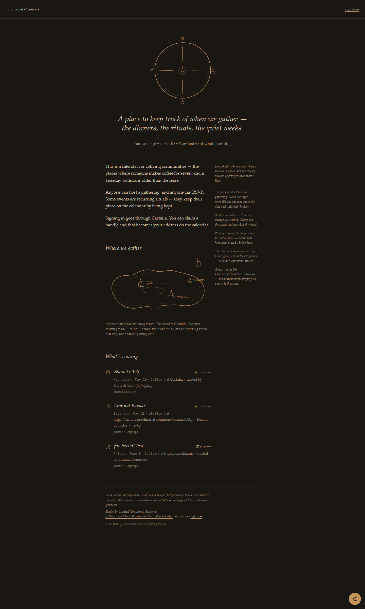

# Liminal Calendar

A calendar for coliving communities and recurring rituals — public events, RSVPs, and 1:1 booking. Castalia-native identity, hand-drawn pages.

Live at **[liminalcalendar.com](https://liminalcalendar.com)**.

<p align="center">
  
</p>

## What it is

A small calendar for a small ecosystem. Built around three things:

- **Public events with RSVPs** — anyone in the community can host, anyone can RSVP. Recurring rituals (weekly dinners, full-moon fires) keep their place by being kept.
- **1:1 booking pages** — claim a handle, set your weekly availability, share `liminalcalendar.com/<handle>` wherever you want bookings to come from. Calendly-style, calmer.
- **A landing that reads like a place, not a SaaS** — hand-drawn seasonal wheel, essay with Tufte-style marginalia glossing the vocabulary, an inked map of the standing gathering places (Castalia, the Liminal Bazaar, the Hearth), and a colophon instead of a footer.

## Features

### Events
- **Recurring** — daily, weekly, biweekly, monthly.
- **Typed** — general, presentation, workshop, social, meeting, standup; color-coded badges in the grid.
- **Visibility** — public, members-only, invite-only.
- **Lifecycle** — 🌱 proposed (>14 days out) · 🌿 confirmed (≤14 days) · 🍂 past.
- **Host-as-attendee** — the creator is automatically counted in the RSVP roll.
- **Embed** — every event has a shareable embed at `/embed/events/<id>`.

### Booking
- Per-member handle (`/<handle>`) with availability heatmap.
- One or more event types per handle (`/<handle>/<slug>`), each with its own duration, location, and slots.
- Atomic booking — `event + rsvps + booking.confirmed` in one transaction, partial unique index guarding against double-booking.
- "Add to calendar" `.ics` action on the embed page.

### Notifications
- 24-hour email reminders for RSVPed attendees (Resend or SMTP).
- At-start push to all members of an event, with per-event mute.
- In-app notification inbox.
- Hourly cron at `/api/reminders` (secured by `CRON_SECRET`, configured in `vercel.json`).

### Calendar UX
- **Golden Hours** — the daypart bands where Europe, Brazil, and the Americas actually overlap. Highlighted in the weekly grid, with a soft (non-blocking) nudge when you schedule outside them.
- **Timezone-aware** — events render in the viewer's local time; the underlying timestamp is stored UTC + zone.
- **Drag-to-reschedule** in the weekly grid.

### Aesthetic
- Hand-drawn inline SVG illustrations (seasonal wheel, marginal icons per event, map of gathering places, compass rose, ink-residue dots) — nothing is fetched, nothing is generated.
- Warm-serif body (Iowan Old Style → Palatino → Hoefler Text → Georgia) on a parchment-or-deep-umber ground.
- Tufte-style sidenotes float into the right gutter on `md:` and collapse to inline italic glosses on mobile.
- Single-class dark mode (set on `<html>` in the root layout).

## Setup

```bash
npm install
cp .env.local.example .env.local
# fill in DATABASE_URL, LOGTO_* (id.castalia.one), CRON_SECRET, EMAIL_FROM,
# and either RESEND_API_KEY or the SMTP_* set.
npx drizzle-kit push   # applies the schema in src/lib/db/schema.ts to Neon
npm run dev
```

Open [localhost:3000](http://localhost:3000).

**Castalia identity** — register the calendar as an application at
[developers.castalia.one](https://developers.castalia.one) and copy the OIDC
client id, secret, and endpoint into the Logto-prefixed env keys. Identity
lives at [id.castalia.one](https://id.castalia.one).

**Database** — Neon Postgres. Schema in `src/lib/db/schema.ts`; migrations
generated and pushed via `drizzle-kit`.

**Email** — either set `RESEND_API_KEY` + `EMAIL_FROM`, or the
`SMTP_HOST` / `SMTP_PORT` / `SMTP_USER` / `SMTP_PASS` quartet.

## Tech stack

- **Next.js 15** (App Router, RSC, async server components)
- **Castalia / Logto** — Liminal Commons identity
- **Neon Postgres** + **Drizzle ORM**
- **Tailwind CSS** (class-strategy dark mode)
- **TypeScript**
- **Jest** + jsdom for unit/component tests

## Deploy

Production is on Vercel (`liminalcalendar.com`), reminder cron wired through
`vercel.json`. To deploy your own:

1. Push to GitHub.
2. Import to Vercel.
3. Set the env vars above in the Vercel project.
4. Add `liminalcalendar.com`-style custom domain.

## License

MIT.
